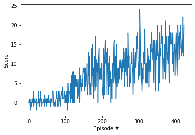

# Report for Project 1: Navigation

### Used Algorithm / Model / Agent

For this project, i used the  model and experience replay agent from the DQN chapter and changed some hyper parameters to reduce the amount of episodes to terminate with mean of 13 points over 100 episodes.  

Both local and target model have the following structure:

    QNetwork(
      (fc1): Linear(in_features=37, out_features=256, bias=True)
      (fc2): Linear(in_features=256, out_features=64, bias=True)
      (fc3): Linear(in_features=64, out_features=4, bias=True)

Hyperparameters used are:

Hyperparameter | Value
------------ | -------------
BUFFER_SIZE (replay buffer size) | int(1e5)  
BATCH_SIZE ( minibatch size) | 64     
GAMMA (discount factor) | 0.95      
TAU (for soft update of target parameters) | 1e-3 
LR (learning rate) | 5e-4               
UPDATE_EVERY (how often to update the network) | 5         
FC1_UNITS (Number of nodes in first hidden layer) | 256
FC2_UNITS (Number of nodes in second hidden layer) | 64
EPS_DECAY (multiplicative factor (per episode) for decreasing epsilon) | 0.990

A plot of rewards per episode to illustrate that the agent is able to receive an average reward (over 100 episodes) of at least +13 you can find below:

During several iteration it took 175 to 324 episodes to solve the environment. The weights for the min and max episodes can be found within the submission.

### Further improvements

As the actual solution is an experience replay agent, obviously using a Prioritized experience replay agent could be a very good improvement.

Also there are a lot of other options shown during the lessons, like

* Double DQN (DDQN)
* Dueling DQN
* A3C
* Distributional DQN
* Noisy DQN
* Rainbow (combination of the above)

To find one of the best solutions, it could be great to do some research on combinations of the mentioned extensions and compare it with **Rainbow**, where Deep Mind already showed that it performs better then each one individually.